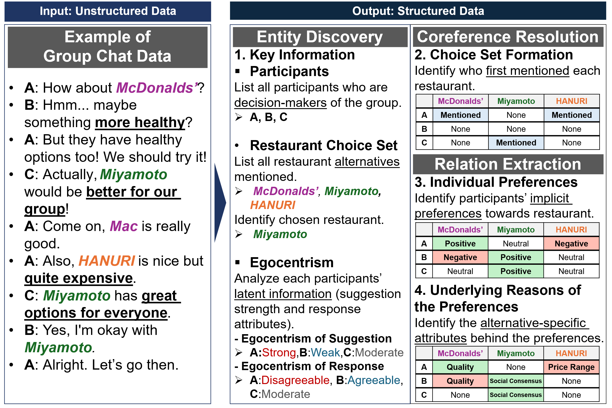
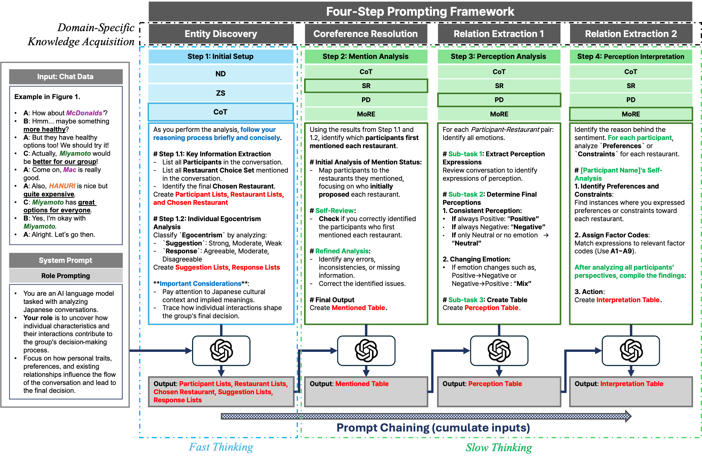

# Interpreting Group Decision-Making Conversations with LLMs

Code, data, and evaluation results for a **four-step prompting framework** that
uses large language models (GPT-4o and GPT-5) to convert unstructured group-chat
dialogues into structured tables of decision-making factors. The case study is
joint eating-out decisions: 47 anonymized Japanese group chats in which friends
decide on a restaurant.

The framework is inspired by the knowledge acquisition process in Knowledge
Graph construction. It sequentially extracts the group-level choice set and
outcome, individual traits and preferences toward each alternative, and the
attribute-based rationales behind those preferences — the key ingredients of
utility-based models of joint activity-travel behavior. LLM outputs are
evaluated against a human-annotated ground truth via a quantitative (F1-based)
analysis and a qualitative error analysis.



> 🖱️ **Try it live:** **<https://syl9205.github.io/group-decision-llm/>** — an interactive
> walkthrough of one real conversation: a chat-app-style view of the dialogue side by side with the
> Step 1.1 → 4 output tables (ground truth vs. GPT-5 vs. GPT-4o), with per-step evidence
> highlighting. (Source: [`docs/index.html`](docs/index.html); after cloning you can also open that
> file directly in a browser.)

## The four-step framework

The chats are ultimately meant to feed **utility-based (discrete) choice models**
of group decision-making. What such models require is exactly what the framework
extracts: the **decision-makers**, the **alternatives** and how the **choice
set** forms, the **final decision**, and the **alternative-specific attributes**
that enter each member's utility. The extraction is organized as
**knowledge-graph construction** — Entity Discovery → Coreference Resolution →
Relation Extraction — so the study evaluates whether an LLM can read
within-group interactions well enough to supply these modeling ingredients.

Each conversation is analyzed in four sequential steps. Outputs of earlier steps
are cumulatively fed into later steps (**Prompt Chaining**), and the system
prompt designates the model as a *"Japan Conversation Analyst"* (**Role
Prompting**).

| Step | Knowledge-acquisition stage | Output | Values |
|------|-----------------------------|--------|--------|
| **1.1** | Entity Discovery | `Participant Lists` · `Restaurant Lists` · `Chosen Restaurant` | extracted names |
| **1.2** | Entity Discovery | `Suggestion Lists` | `Strong` / `Moderate` / `Weak` |
| **1.2** | Entity Discovery | `Response Lists` | `Agreeable` / `Moderate` / `Disagreeable` |
| **2**   | Coreference Resolution | `Mentioned Table` | `Mentioned` / `None` |
| **3**   | Relation Extraction | `Perception Table` | `Positive` / `Negative` / `Neutral` / `Mix` |
| **4**   | Relation Extraction | `Interpretation Table` | `A1`, `A2`, …, `A7` / `None` |

**What each output represents (in choice-modeling terms)**

- `Participant Lists` — the **decision-makers** of the group choice (anonymized as A, B, C, …)
- `Restaurant Lists` — the **alternatives** raised in the conversation, resolved to official
  names via the chat's link table
- `Chosen Restaurant` — the **final decision** (the observed choice outcome)
- `Suggestion Lists` / `Response Lists` — **latent individual traits of the decision-makers**
  (egocentrism in proposing one's own preference vs. responding to others'), typically
  unobservable in traditional surveys
- `Mentioned Table` — **choice-set formation**: who first introduced each alternative,
  capturing how the group's choice set emerges dynamically rather than being fixed a priori
- `Perception Table` — each decision-maker's **preference polarity** toward each alternative
- `Interpretation Table` — the **alternative-specific attributes** behind those preferences —
  the factors that would enter a utility specification (union of preference and constraint
  factor sets per cell)

**Step 4 factor codes** — `A1` Restaurant Quality · `A2` Accessibility & Location ·
`A3` Schedule Constraints · `A4` Social Utility for Consensus · `A5` Inertia ·
`A6` Economic Considerations · `A7` Others

**Prompting techniques — a dual-process design (Kahneman)**

The prompt design follows **dual-process theory**: extracting explicit
choice-model elements (who, which alternatives, what was chosen) is a
**fast-thinking** task suited to simple prompts, while inferring the implicit
reasoning inside the group — up to the alternative-specific attributes — is a
**slow-thinking** task requiring structured reasoning prompts.

- Step 1 (*fast thinking* — explicit elements): `ND` (no delimiters), `ZS` (zero-shot with delimiters), `CoT`
- Steps 2–4 (*slow thinking* — implicit interpretation): `CoT`, `SR` (Self-Refine), `PD` (Prompt Decomposition), `MoRE` (Mixture of Reasoning Experts)



(A per-technique breakdown figure is also available at
`figures/fig4_prompt_techniques.png`, and the full prompt texts are in
[`pipeline/01_prompts.ipynb`](pipeline/01_prompts.ipynb).)

Each (step × technique) runs for **5 iterations**. For the carried-forward
context, a controlled selection strategy picks the technique with the highest
average F1 across iterations and passes its single best iteration to the next
step, so each step is evaluated with minimal bias from upstream errors.

**Model configurations**

- **GPT-4o** (`gpt-4o-2024-11-20`), temperature 0
- **GPT-5** (`gpt-5-2025-08-07`), reasoning effort `medium` (default)

## Repository structure

```
group-decision-llm/
├── data/                 # Conversations + gold-standard annotations
│   ├── logs/             #   47 anonymized chat logs (<id>_log.txt)
│   ├── gold/             #   gold annotations per conversation (steps 1.1–4)
│   └── json/             #   the same conversations in JSON form
├── pipeline/             # Analysis: prompt library, pipeline runs, output merging
│   ├── 01_prompts.ipynb  #   full prompt library, with the paper's prompt figures inline
│   ├── 02_run_pipeline_gpt4o.ipynb
│   ├── 03_run_pipeline_gpt5.ipynb
│   ├── 04_merge_results_gpt4o.ipynb
│   └── 05_merge_results_gpt5.ipynb
├── evaluation/           # Evaluation: scores, tables, and figures of the paper
│   ├── 01_evaluation_gpt4o.ipynb          # Step 1–3 score tables + plots (GPT-4o)
│   ├── 02_evaluation_gpt5.ipynb           # Step 1–3 score tables + plots (GPT-5)
│   ├── 03_evaluation_step4_gpt4o.ipynb    # Step 4 Positive-F1 (GPT-4o)
│   ├── 04_evaluation_step4_gpt5.ipynb     # Step 4 Positive-F1 (GPT-5)
│   ├── 05_per_technique_tables.ipynb      # Per-technique averages (Tables 6–7)
│   └── 06_confusion_matrix.ipynb          # Confusion matrices (Figures 7–9)
├── results/              # Evaluation outputs backing the paper
│   ├── gpt4o/            #   score tables + distribution plots (GPT-4o, t = 0)
│   ├── gpt5/             #   score tables + distribution plots (GPT-5)
│   ├── confusion_matrix/ #   confusion-matrix figures (Japanese prompt)
│   └── per_technique_eval_detail.csv      # per-conversation detail for Tables 6–7
├── figures/              # Paper figures: framework overview (this README)
│   └── prompts/          #   prompt boxes B.1–B.16 (paper Appendix B), embedded in pipeline/01
├── docs/                 # Interactive walkthrough of one conversation (docs/index.html)
└── appendix/             # Supplementary analyses
    ├── code/             #   single-prompt baseline, American-persona ablation
    └── results/          #   comparison/ (Table 5), american/ (Table A.1), CMs
```

## Where each paper result comes from

| Paper item | File(s) | Produced by |
|---|---|---|
| Table 5 (Prompt Chaining vs. single prompt) | `appendix/results/comparison/unified_eval_summary.csv`, `unified_eval_by_conv.csv` | `appendix/code/eval_unified_single_vs_4step.ipynb` |
| Table 6 (Step 1, per technique) | `results/<model>/Step1_1_Score.csv`, `Step1_2_Score.csv`; `results/per_technique_eval_detail.csv` | `evaluation/01`, `02`, `05` |
| Table 7 — Mentioned Table (Step 2) | `results/<model>/Step2_Score.csv`; `results/per_technique_eval_detail.csv` | `evaluation/05` |
| Table 7 — Perception Table (Step 3) | `results/<model>/Step3_Score.csv` | `evaluation/01`, `02` |
| Table 7 — Interpretation Table (Step 4) | `results/<model>/Step4_Integrated_Score.csv` (`F1_Pos_Int`) | `evaluation/03`, `04` |
| Figures 7–9 (error matrices) | `results/confusion_matrix/*.png` | `evaluation/06` |
| Table A.1 (Japan vs. American persona) | `appendix/results/american/american_eval_summary.csv` | `appendix/code/american_03_evaluation.ipynb` |

The `Step*_plot.png` files in `results/<model>/` are per-conversation
distribution plots (box plots + jittered points) of the same scores — a
per-conversation view that complements the averaged numbers reported in the
paper tables.

## Evaluation metrics

- **Steps 1–3:** set-based F1 over the elements / (participant, label) pairs /
  (participant, restaurant, label) triplets defined for each step. For Step 2,
  F1 is computed over the pairs labeled `Mentioned`.
- **Step 4:** **Positive-F1** — the mean per-cell factor-set F1 over cells where
  the ground truth contains at least one factor.
- Steps 2–4 are scoped to the participant/restaurant sets carried forward from
  Step 1 of the pipeline.

## Reproducing the analysis

1. **Install dependencies**

   ```bash
   pip install openai pandas numpy nbformat matplotlib openpyxl
   ```

2. **Provide an OpenAI API key** via the `OPENAI_API_KEY` environment variable:

   ```bash
   export OPENAI_API_KEY="sk-..."
   ```

3. **Run the notebooks from the repository root** (all paths are relative to
   it), in this order:

   1. `pipeline/02`–`03` — run the pipeline per conversation; raw per-iteration
      outputs are written to `results/<model>/raw/` (git-ignored, tens of
      thousands of JSON files). The run cell is parameterized per conversation;
      Step 1 includes an interactive name-normalization step via an Excel file.
   2. `pipeline/04`–`05` — merge raw outputs into per-step tables.
   3. `evaluation/01`–`06` — compute score tables, plots, and confusion
      matrices from the raw outputs.

   Notebooks are provided **with their original execution outputs**, so the
   full analysis trace can be read without re-running anything.

## Data

The 47 conversations come from the **x-GDP** dataset (*Text-aided Group
Decision-making Process Observation Method*; Parady et al., 2025,
[doi:10.1007/s11116-023-10426-9](https://doi.org/10.1007/s11116-023-10426-9)) —
an IRB-approved naturalistic experiment in which real groups of 3–5 friends
coordinated an actual eating-out activity over LINE and were required to execute
the chosen plan (verified with photos and transaction records). Each chat
captures the full decision sequence from initial proposals to the final
restaurant choice (on average 65.9 messages and 6.6 candidate restaurants per
conversation). Ground truth was hand-coded from every message by native-Japanese
domain experts in travel behavior research.


*Overview of the x-GDP experiment process (source: Parady et al., 2025).*

See [`data/README.md`](data/README.md) for descriptive statistics, the log
format, the gold-annotation schema, and the Step 4 factor codes.

## Citation

If you use this code or data, please cite:

> Lim, S.Y., Sato, K., Takami, K., Parady, G., Kim, E.J.\* (2026). Can Large Language Models
> Interpret Unstructured Chat Data on Dynamic Group Decision-Making Processes? Evidence on Joint
> Destination Choice. *arXiv preprint* arXiv:2601.05582.
> <https://arxiv.org/abs/2601.05582> — currently under revision in *Travel Behaviour and Society*.

```bibtex
@article{lim2026llmgroupdecision,
  title   = {Can Large Language Models Interpret Unstructured Chat Data on Dynamic
             Group Decision-Making Processes? Evidence on Joint Destination Choice},
  author  = {Lim, S.Y. and Sato, K. and Takami, K. and Parady, G. and Kim, E.J.},
  journal = {arXiv preprint arXiv:2601.05582},
  year    = {2026},
  url     = {https://arxiv.org/abs/2601.05582},
  note    = {Under revision in Travel Behaviour and Society}
}
```

*(This section will be updated with the journal citation upon publication.)*

If you use the conversation data, please also cite the data-collection
methodology:

> Parady, G., Oyama, Y., Chikaraishi, M. (2025). Text-aided Group
> Decision-making Process Observation Method (x-GDP): a novel methodology for
> observing the joint decision-making process of travel choices.
> *Transportation*, 52, 413–437. https://doi.org/10.1007/s11116-023-10426-9

## License

The **code** is released under the [MIT License](LICENSE). The **conversation
data** under `data/` is provided for research purposes only — see the Data
Notice in [LICENSE](LICENSE) for the terms (cite the x-GDP paper, no separate
redistribution, no re-identification attempts).
