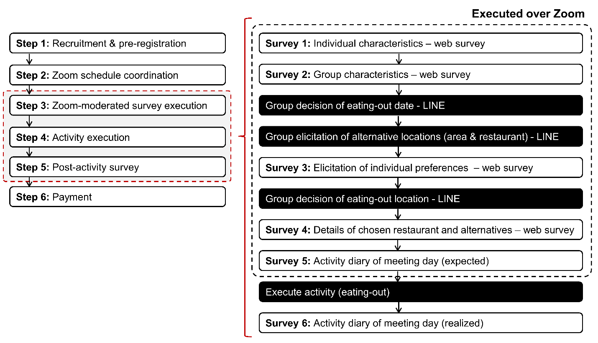

# Data

Anonymized Japanese group conversations in which a group of friends decides on a
restaurant to eat out, together with gold-standard annotations. Speakers appear
only as anonymized letters (`A`, `B`, `C`, …); personal names and nicknames that
appeared inside message text have been masked (names referring to a participant
are replaced by that participant's letter, third-party names by a neutral
placeholder).

## Data source: the x-GDP experiment

The conversations come from the **x-GDP** dataset (*Text-aided Group
Decision-making Process Observation Method*; Parady et al., 2025). x-GDP is a
naturalistic, IRB-approved experiment in which real groups of three to five
friends coordinate an actual eating-out activity over **LINE**, Japan's most
widely used messaging platform. Each chat documents the complete decision-making
sequence in real time — initial proposals, preference negotiation, and the final
restaurant selection. To ensure the realism of the decision process, groups were
required to actually execute the planned activity, verified with photographic
evidence and transaction records.

*Overview of the x-GDP experiment process (source: Parady et al., 2025).*

**The 47 conversations in this repository are the group decision-making chats
from that experiment, and exactly this set is used in every LLM analysis of the
study.**

### Descriptive statistics (n = 47)

| Group-level characteristic | n | Share |
|---|---|---|
| Group size — 3 persons | 20 | 42.6% |
| Group size — 4 persons | 18 | 38.3% |
| Group size — 5 persons | 9 | 19.1% |
| Hierarchy — none | 37 | 78.7% |
| Hierarchy — two-level | 9 | 19.1% |
| Hierarchy — three-level | 1 | 2.1% |
| Gender — male-only | 28 | 60.9% |
| Gender — female-only | 3 | 6.5% |
| Gender — mixed | 15 | 32.6% |

(Gender shares exclude one group with missing gender information. Hierarchy was
self-reported; in this context it generally reflects age or grade differences.)

| Continuous variable | Mean | Std. | Min | Max |
|---|---|---|---|---|
| Messages per conversation | 65.9 | 46.0 | 15 | 182 |
| Candidate restaurants | 6.6 | 3.1 | 3 | 17 |

### Source citation

> Parady, G., Oyama, Y., Chikaraishi, M. (2025). Text-aided Group
> Decision-making Process Observation Method (x-GDP): a novel methodology for
> observing the joint decision-making process of travel choices.
> *Transportation*, 52, 413–437.
> https://doi.org/10.1007/s11116-023-10426-9

## Contents

| Path | Description |
|------|-------------|
| `logs/` | 47 conversation logs (`<id>_log.txt`) — the set used in all analyses |
| `gold/` | Gold-standard annotations, one folder per conversation (47) |
| `json/` | The same conversations in JSON form (`<id>_conversation.json`) |

> These 47 conversations are exactly the set used in every experiment.

## Conversation log format (`logs/<id>_log.txt`)

Plain text with two sections:

- **CONVERSATION PART** — one utterance per line, `Speaker<TAB>Message`
  (messages are in Japanese, including colloquialisms and slang).
- **INFORMATION PART** — a `Website Link` ↔ `Restaurant` table that maps links
  shared in the chat to the official restaurant names (some links are blank when
  a restaurant is named without a link).

## Gold annotations (`gold/<id>_log/`)

Five JSON files per conversation, one per analysis step. Ground truth was
established by domain experts in travel behavior research, following factor
definitions derived from utility-based choice modeling: native Japanese speakers
manually reviewed every message and coded candidate mentions, expressions of
preference and constraints toward candidates, and agreement / disagreement /
conformity with others' opinions. Codes were assigned only when the
corresponding expression was explicitly observed in a message, and the gold
dataset was constructed from these coded annotations:

| File | Annotation |
|------|------------|
| `step1_1_gold.json` | Participants, restaurant brands, and the final chosen restaurant |
| `step1_2_gold.json` | Egocentrism: suggestion strength (Strong/Moderate/Weak) and response attribute (Agreeable/Moderate/Disagreeable) per participant |
| `step2_gold.json`   | MentionedTable — who first mentioned each restaurant |
| `step3_gold.json`   | Perception/sentiment (Positive/Negative/Neutral/Mix) per participant–restaurant pair |
| `step4_gold.json`   | Preference and constraint factors (codes `A1`–`A7`) per participant–restaurant pair |

The factor codes used in Step 4:

| Code | Factor |
|------|--------|
| **A1** | Restaurant Quality |
| **A2** | Accessibility & Location |
| **A3** | Schedule Constraints |
| **A4** | Social Utility for Consensus |
| **A5** | Inertia |
| **A6** | Economic Considerations |
| **A7** | Others |

> The data is anonymized and intended for research use.
